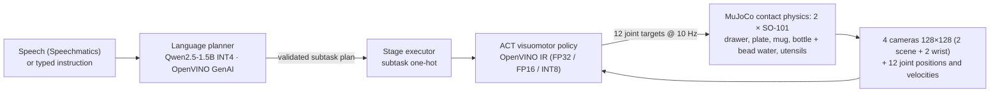

# Table for Two — bimanual SO-101 table setting on OpenVINO


Two simulated SO-101 arms set a dinner table from a spoken or typed instruction:
carry the plate to the placemat with both hands, open the drawer while placing
the mug, lay the fork, pour water from the bottle into the mug, put the bottle
back, and hand the spoon from one arm to the other. Built for the **Intel
Physical AI Online Challenge — Bimanual VLA Manipulation** at the AI Infra
Summit Hackathon (lablab.ai, September 2026).

Everything runs in MuJoCo; every learned model runs through **OpenVINO**.

**No object is ever attached to a gripper.** Every object moves only because
the finger pads squeeze it and simulated friction holds it, the drawer opens
because a finger pulls on its handle, and the water is 24 small beads that
pour like lentils. The gripper is modelled on the stock 7.4 V servo at the
torque it can sustain (0.8 N·m, about 10 N at the fingertip, not the 2.94 N·m
stall figure), with rubber pads of μ = 0.8. Object mass, pad friction and
object friction are randomised per scene.

## Why it matters

Table setting is a stand-in for the everyday two-handed jobs a home or
care-home assistant robot would do: fetch from a drawer, carry something too
wide for one hand, pour, pass an object from one hand to the other. The SO-101
costs about $100 an arm and its whole inference stack here — planner, policy
and stage detection — runs on an Intel laptop's CPU and integrated GPU through
OpenVINO, with no cloud and no discrete GPU at run time. Everything the arms do
is held by simulated friction, so what works here has a chance of working on
the printed fingers of a real SO-101.

## How it works



1. **Planner** — a 1.5 B instruction model writes a compact plan language, one
   stage per line (`bimanual_place plate`, `open_drawer left ; pick_place right mug`,
   `handoff spoon left right`, …).
   The plan is parsed, then checked twice: syntax (known skills, arms, objects)
   and a small simulation of what each hand holds (no pouring without the bottle
   in hand and the mug set down, no placing what is not held, utensils only after
   the drawer opens). Errors go back to the model for one retry; leftover bad
   steps are dropped; a keyword planner is the last resort.
2. **Executor** — runs the plan stage by stage; subtasks in one stage run on both
   arms at the same time. Each stage gives the policy a one-hot subtask token —
   this token is how language reaches the policy (a planner-conditioned ACT, not
   an end-to-end VLA).
3. **Policy** — LeRobot ACT trained on scripted demonstrations, exported to
   OpenVINO and quantised to INT8 with NNCF. It sees four 128×128 cameras and
   the positions and velocities of the 12 joints, nothing else.
4. **Scripted skills** — generate the demonstrations and act as the fallback in
   hybrid mode (see below). They use ground-truth object poses and contact
   events from the simulator; the policy has to learn the same behaviour from
   pixels.

## Grasping by contact

The scripted skills position the open jaws around an object, close past contact
so the servo keeps squeezing, and move. Getting there took measuring the robot:

| Skill | How the SO-101 does it | Why |
|---|---|---|
| Bottle | side grip on the body, open hand lowered around it from above; pours by tilting about the grip while the lowest point of the lip stays over the mug | a top-down grip covers the mouth, so the water runs onto the wrist (0/24 beads in the mug) |
| Drawer | top-down pinch on the bar pull, fixed finger on the arm side, moving jaw dropped into the gap at a set opening | closing the other way round needs more wrist roll than the arm has; opening wider lands the finger on the drawer front |
| Utensils | top-down pinch on a 10 mm-square handle, jaws stopping 1 mm above the surface | the jaws' collision bodies end 8 mm below the tool point; a flat 5 mm handle leaves the pads 1–2 mm to squeeze |
| Hand-over | both wrist-camera mounts face away from the other hand, spoon held 30° off crosswise, grips 5.6 cm apart | found by a search over angle, grip points and height, measuring the distance between the two arms' collision bodies; straight crosswise they touch |
| Plate | carried by **both arms**, each pinching an opposite 5 mm wall (thin fixed finger inside, moving jaw outside), moving in lockstep | one hand on one wall leaves the plate hanging 6–8° (its centre of mass is 4.5 cm from the pinch); with two hands it stays within 2.5°. On a 3 mm wall the jaws closed to their joint limit and the plate slid 1–2 cm through the pads at set-down once the servo torque was made realistic |
| Mug | top-down across the body just below the rim, handle beside the jaws, tipped level while carried | — |
| Utensils (one arm) | gripped over their centre of mass | gripped at the handle end the fork sagged 12–17° and slid |
| Every set-down | lowered in 1.5 mm steps until the object touches a support, then the fingers open and slide off the object before lifting | releasing at a computed height dropped the fork 2.8 cm at 0.7 m/s; lifting straight after opening let two hands inside the plate lift it and fling it |

Reach shaped the layout: a top-down hand reaches at most 9 cm above the table
(18–24 cm from the base), a jaws-horizontal hand reaches the table only 30 cm
or more out, so the bottle stands at the far edge of the right arm's workspace.
`tools/grasp_lab.py`, `tools/pour_lab.py` and `tools/trace_stage.py` are the
single-object labs and the per-stage tracer used to find each of these.

## Scene

| Item | Detail |
|---|---|
| Robots | 2 × SO-101 (MuJoCo Menagerie `robotstudio_so101`), 6 position actuators each, Menagerie's grasp contact settings (elliptic cones, `impratio` 10) |
| Gripper | torque capped at 0.8 N·m (stock 7.4 V STS3215: 1.62 N·m stall, overload protection trips within seconds at stall); finger pads μ = 0.8; measured pad force while holding 20–27 N |
| Task objects (child-tableware scale, sized for a 5 cm jaw) | cabinet with a full-extension drawer and bar pull; spoon and fork with chunky 10 mm handles (9.6 cm long, ~23 g); a 9 cm ramekin-sized deep dish (120 g); a 4.8 cm espresso mug (130 g); a 3.2 × 7 cm glass vial (40 g) with 24 water beads (6.5 ml); placemat |
| Cameras | overhead, operator (behind the arms), front-high, one on each wrist |
| Control | 20 Hz joint targets; policy at 10 Hz |
| Randomisation per seed | object position ±1.2 cm (utensils ±4 mm, ±0.08 rad yaw), object mass ×0.8–1.2, pad friction ×0.7–1.3 (this is what changes grasps: the pads' friction governs every finger–object contact), object friction μ 0.4 ×0.7–1.3 (ceramic or glass sliding on wood; MuJoCo uses the larger of two surfaces' friction, so table and props are both 0.4), light ×0.6–1.2, table colour |
| Success (scored 1 s after the last motion) | drawer open > 4.5 cm *now*; plate, fork, spoon and mug within 3 cm of their places, resting on the table only (not on each other), upright (< 12°) and released; ≥ 60 % of the beads at rest inside the mug with ≤ 2 spilled; bottle lifted, then standing upright within 3 cm of where it started |

## Results

**Scripted contact pipeline.** Seeds 0–9 are the evaluation seeds the brief
asks for (seed 0 is the nominal layout, 1–9 randomised) and also the seeds the
skills were debugged on, so they are reported next to a block of 30 seeds
(1000–1029) that were never looked at. Measured in the current scene (props
slide on the table at μ 0.4; `out/scripted_friction04_seeds0-9_1000-1029.txt`):

| Sub-goal | Seeds 0–9 | Unseen seeds 1000–1029 |
|---|---|---|
| Drawer opened (pulled by its handle) | 10/10 | 30/30 |
| Mug placed | 10/10 | 30/30 |
| Plate on placemat (two-handed) | 10/10 | 30/30 |
| Fork placed | 10/10 | 30/30 |
| Spoon handed over and placed | 10/10 | 30/30 |
| Poured (≥ 60 % of the beads in the mug, ≤ 2 spilled) | 10/10 | 29/30 |
| Bottle put back | 10/10 | 30/30 |
| **Full task** | **10/10** | **29/30** |

(At the earlier μ 1.0 both columns were full; at 0.4 seed 1009's pour misses the
bead threshold.)

`tools/audit_contact.py` checks every hold on seeds 0–9 (`out/audit_contact_final.txt`):
no object is lost while the fingers squeeze; every set-down touches the table
at ≤ 0.031 m/s before the fingers open (one exception: on seed 1 the fork was
let go 0.4 mm up, landing at 0.05 m/s). In the hand, the plate tilts up to
10° and shifts up to 13 mm when one arm carries more of it; the spoon sags
8–17° during the hand-over; the mug and the fork stay within 4°.

**Language planner.** On 20 paraphrased instructions (`tools/planner_eval.py`,
different wording, order, synonyms, partial requests, named arms) every plan
passes the syntax and hand-state checks, and 14/20 contain exactly the steps
asked for; 13 of the 20 plans came from the language model (the rest from the
keyword fallback after the model's plan failed the checks). The commonest
mistake is adding an unrequested step. Latency on Intel hardware
(`bench/benchmark.py`, 5 instructions, current prompt; on those five the
model's own plan was accepted as written 2/5 times, the other three went
through precondition completion or the keyword fallback):

| Device | Plan latency mean / p95 (s) | Time to first token (ms) | Time per token (ms) | Tokens/s |
|---|---|---|---|---|
| CPU (i9-14900HX) | 1.44 / 4.10 | 516 | 18.0 | 55.6 |
| Intel iGPU (Raptor Lake UHD) | 2.34 / 4.69 | 759 | 34.7 | 28.8 |

**Learned policy (v3: 280 demonstrations, 120k steps, four cameras).** LeRobot
ACT trained on 266 scripted episodes (14 held out) in the current scene, with
the pour and the first frames of every stage oversampled (see Honest notes).
Held-out validation loss kept falling to the end: 0.0222 at 80k, 0.0211 at
100k, **0.0190 at 120k** (`tools/val_loss.py`, `out/act_contact_v3_val_loss_120k.json`).
A further 20k steps did not help: from a scripted start the 140k checkpoint
pours 2/10 (18.2 beads in, 5.8 spilled) and hands the spoon over 0/10
(`out/v3_140k_rollout_stagewise_*`), so 120k is the released policy.
Stage success on the ten evaluation seeds with temporal ensembling and the
oracle stage switch (`policy/rollout.py`; `home` stages are not scored). A
stage counts only if the policy finishes it within its time limit: 60 s for
the pour, 45 s for the hand-over, 40 s otherwise (the demonstrated pours take
40 s on average, up to 47 s). With 10 seeds a rate's 95% interval is about
±0.25 (Wilson intervals are in every report):

| Stage | Chained, FP32 | Chained, INT8 | Each stage from a scripted start | Stage from a scripted start at 100k |
|---|---|---|---|---|
| Two-handed plate carry | 10/10 | 10/10 | 9/10 (80k) | — |
| Drawer + mug | 10/10 | 10/10 | 10/10 (80k) | — |
| Bottle lift + fork | 8/10 | 8/10 | 10/10 (80k) | — |
| Pour | 0/10 | 1/10 | **3/10** | 2/10 |
| Bottle back | 6/10 | 9/10 | **10/10** | 9/10 |
| Spoon hand-over | 3/10 | 0/10 | **5/10** | 0/10 |
| **Whole table in one run** | **0/10** | **0/10** | — | — |

(`out/v3_120k_rollout_policy_ens_seeds0-9.json`,
`out/v3_120k_rollout_policy_int8_ens_seeds0-9.json`,
`out/v3_120k_rollout_stagewise_{pour,return,handoff}_seeds0-9.json`; stages
that already scored 9–10/10 from a scripted start at 80k were not re-run.)

How to read this: the first three stages are learned. The pour is closer than
its score: from a scripted start the policy gets 20.1 of the 24 beads into the
mug on average (16–24; every seed clears the 60 % bar), but spills 3–8 beads in
7 of 10 scenes against the ≤ 2 allowed. In the chained run it rarely gets that
far: after its own bottle pick the water stays in the bottle in 6 of 10
scenes. The hand-over went from 0/10 at 100k to 5/10 at 120k, and validation
loss was still falling, so the policy is under-trained rather than stuck; we
ran out of time to train further. The chain breaks where one stage leaves a
state (the bottle's place in the fingers, where it was set down) that the next
stage never saw in the demonstrations.

The ensembling weight matters for the hand-over. With `--ensemble 0.1`
(older chunk predictions weigh more) the hand-over from a scripted start rises
from 5/10 to 8/10 on seeds 0–9; since those are the evaluation seeds, we checked
it on 30 unseen seeds (1000–1029): 21/30 against 16/30 with 0.01
(`out/v3_120k_handoff_unseen_ens*.json`). The pour stays at 3/10 with slightly
more spilled (4.6 beads), and the chained run does not improve (stages solved
10/10/8/0/6/1, the plate ends in place only 7/10), so every table above uses 0.01.

Hybrid mode (a scripted skill finishes any stage the policy timed out on,
counted as assisted, never as a success): no full table
either (0/10, `out/v3_120k_rollout_hybrid_ens_seeds0-9.json`). The script took over
2.3 stages per episode (the pour 10/10 times, the hand-over 8, the bottle return
3) and got the water in on 3 seeds and the spoon placed on 6, but starting from
wherever the policy stopped, its motions knocked earlier work: the plate and the
mug end in place 7/10 each, against 10/10 with the policy alone. Scripted skills
are reliable from the states they planned for (the scripted pipeline: 10/10),
not from arbitrary ones; the demo video therefore gives the stages the policy
fails to the script from the start (see Honest notes).

OpenVINO latency of the four-camera network, isolated single call (zero
inputs, 200 calls, machine otherwise idle; `bench/benchmark.py` writes
`out/benchmark.md`). Action error is the export's own check against FP32 on
calibration frames (`models/<export>/export_report.json`):

| Model | CPU mean / p95 (ms) | Intel iGPU mean / p95 (ms) | Size (MB) | Action error vs FP32, mean / max (rad) |
|---|---|---|---|---|
| FP32 | 16.5 / 19.8 | 13.8 / 14.2 | 136.8 | — |
| FP16 | 15.7 / 17.1 | 13.7 / 14.0 | 68.4 | 0.00007 / 0.0006 |
| INT8 (NNCF) | 4.9 / 5.2 | 14.4 / 14.7 | 38.6 | 0.0050 / 0.423 |

INT8 on CPU is the fastest configuration (202 calls/s). Its worst case looks
alarming — one output off by 0.42 rad on one calibration frame, against a mean
of 0.005 — and in closed loop on seeds 0–9 the INT8 policy
scores like FP32 within the noise of ten scenes (same first three stages; pour
1 vs 0, bottle back 9 vs 6, hand-over 0 vs 3; neither sets a whole table). NNCF's accuracy-controlled mode (`--accuracy-control --max-drop
0.02`) returned the same fully quantised model for the 80k checkpoint, because by
NNCF's own metric the drop was only 0.008. Every rollout report also records the in-the-loop cost
(render + preprocess + infer + postprocess) of its own run.

## Honest notes

- **The mug stands on the table while it is poured into; the other hand does not
  steady it.** The brief's scene has one hand hold the cup while the other pours.
  With two SO-101s a full pour is only reachable by rolling the bottle sideways
  toward the other arm, which puts the steadying hand beside the mug's rim. We
  searched 12 mug positions × pour directions × steadying grips (body side-grip,
  handle pinch; 6 cm and 9 cm mugs), measuring the distance between the arms'
  collision bodies over every pour pose: the best layout left 3 mm, most
  overlapped, and with a 9 cm mug no position allowed a full pour at all. A
  second search (`tools/steady_search.py`, `out/steady_search.json`) tried the
  grips the first one had not: a top-down pinch on the mug rim from 8
  directions, with the mug on the table or lifted 4 or 8 cm towards the bottle,
  at 20 mug positions, against the real pour planner. None of the 431
  combinations kept 10 mm between the arms: wherever the left hand reaches the
  rim, the arms overlap by at least 21 mm during the pour, and a lifted mug is
  out of reach of a top-down hand (it tops out ~9 cm above the table). So the
  bimanual coordination is shown instead by the two-handed plate carry and the
  spoon hand-over.
- **The hand-over holds the spoon off its balance point** (each hand 2.8 cm from
  the handle centre, the only collision-free layout found), so the spoon sags
  8–17° in the hands; it is still set down by touch.
- **During the pour the bottle can graze the mug rim** (seed 9: an 8 N bump,
  the mug moved 0.9 mm, all 24 beads still landed inside).
- **Water is 24 beads**, not a fluid: each is a sphere of 4 mm radius and
  0.27 g (6.5 ml in all), a granular proxy that pours like lentils. Container
  bases are 8 mm thick; with 5 mm bases the beads tunnelled through the disc.
- **The gripper model is our choice, not Menagerie's.** The Menagerie file
  models the optional 12 V servo at stall (2.94 N·m, ~37 N at the tip, 75–160 N
  of pad force in our earlier runs — 340× a spoon's weight) with hard fingers
  at μ = 1. We cap the torque at 0.8 N·m and use μ = 0.8 rubber pads. Pad force
  while holding is now 20–27 N. Real pad friction on a wet ceramic mug may be
  lower.
- **The props are child-tableware scale** (the jaws open 5 cm): chunky 10 mm
  handles, a ramekin-sized dish, a vial for a bottle. A flat 2 mm steel fork is
  out of this gripper's reach.
- **The demonstrations are privileged.** Scripted skills read exact object
  poses, centres of mass and contact events (set-downs stop at the first
  contact). The policy sees only cameras and joints, with no gripper load
  signal, so it must learn timing from pixels.
- **Stage completion: two modes, both reported.** With `--switch oracle` the
  evaluator reads the physical state to decide when a stage is done and
  advances the policy's subtask token. With `--switch head` a small
  stage-completion network (`policy/stage_head.py`, same cameras and joints as
  the policy, trained on the same demonstrations, run through OpenVINO) makes
  that call and the oracle only scores it. `home` stages are never scored, and
  a stage's success is also reported conditional on every earlier stage having
  been solved by the policy. The learned switch is not usable yet: trained on
  the v3 demonstrations and run with the 80k v3 policy it ends stages early —
  the plate carry scores 0/10 although the plate ends up placed in 9 of 10
  runs — and gets 8/10 for the drawer + mug and the bottle + fork stages and
  0/10 for the rest (`out/v3_80k_rollout_policy_ens_head_seeds0-9.json`), so
  every number in the results table uses the oracle switch.
- **A still hold at the end of every demonstrated stage taught the policy to
  freeze.** The scripted skills end each stage with 2.5 s of standing still,
  so an evaluation can switch stages where the demonstrations do. That is ~26
  frames per stage saying "stay put", while a static arm starting to move shows
  up only in the first frames of the next stage. The v3 policy at 80k steps
  stopped at the start of the pour: 1/10 even from a clean scripted start
  (v2, trained on demonstrations without the hold: 7/10), and in the seed-0
  video the arms are all but still for 40% of the episode
  (`out/v3_80k_seed0.mp4`). Training now shows the first 10 frames of every
  stage five times per epoch (`policy/train.py --start-oversample`); from
  100k steps on the policy no longer freezes.
- **The scripted bottle return used to need the scripted bottle pick.** It
  read the grasp that `side_pick_bottle` had planned, and did nothing if the
  policy had picked the bottle up instead, so in hybrid runs and policy demos
  "bottle put back" could never be finished by the script (hybrid, 80k: 0/10).
  The return now reads the grasp off the hand holding the bottle
  (`tests/test_return_after_policy_pick.py`); hybrid numbers above are from
  after the fix.
- **The demo packs steps into the stages the policy knows.** The policy was
  trained on the default plan's stages, one of which has the left hand lay the
  fork while the right hand lifts the bottle. A planner may write those as two
  steps; `demo.py --executor policy` merges such neighbours back into the
  two-arm stage before executing (same actions, done in parallel), and a step
  the policy was never trained on is done by the scripted skill and captioned
  so. The plan shown in the video is the planner's own output. Evaluation
  (`policy/rollout.py`) runs the default plan and is not affected.
  `--scripted-stages pour return handoff` hands the stages the policy fails
  in evaluation to the scripted skill from the start (captioned "scripted
  skill"), so the video is not a policy's failed attempt followed by a
  takeover in a disturbed scene; the scores above are unaffected.
- **The planner fills in preconditions.** If the language model writes
  "pour" without picking up the bottle, or asks for a fork with the drawer
  shut, `planner.complete()` inserts the missing steps and logs it; on 20
  paraphrased instructions the rate of fully correct plans is reported in
  `out/planner_eval.json`.
- **Hardware.** The challenge targets Intel Core Ultra Series 2/3. This build
  was developed and benchmarked on an Intel Core i9-14900HX with its Raptor Lake
  integrated GPU; the NVIDIA RTX 4060 in the same laptop was used only to train
  ACT — every inference number is Intel CPU or iGPU. `bench/benchmark.py`
  reproduces every number on a Core Ultra machine in one command.
- **Hybrid mode** is reported separately from pure-policy results: a stage the
  scripted skill had to finish is counted as assisted, never as a policy success.
- **Runs are deterministic given the seed** (IK restarts are seeded per
  episode). Policy rollouts used not to be: with MuJoCo's default 4x
  anti-aliasing the wrist-camera images of one state differed by a grey level
  from render to render, and the closed loop grew that into a different
  rollout. The scene now renders without multisampling (stills and videos for
  people keep it); the same seed replays exactly, and two independent INT8
  evaluations on seeds 0–9 gave identical per-stage counts. Every rate is
  reported with its 95% Wilson interval, which for 10 scenes is wide.
- An earlier version of this project (git history) attached objects to the
  gripper with weld constraints; it was replaced because that is not how a real
  gripper holds anything.

## Run it

Requirements: Python 3.12 (Ubuntu 24.04's default), git, ~10 GB of disk.
On Ubuntu: `sudo apt install python3.12-venv libegl1 libgl1 fonts-dejavu-core git`.
A headless Linux machine (no display) also needs `export MUJOCO_GL=egl` before
anything that renders (recording, rollouts, videos); the scripted evaluation
renders nothing and runs anywhere.

### 1. Install (10–20 min, mostly PyTorch)

```bash
bash scripts/install.sh                                         # Linux; add --cuda for GPU training
powershell -ExecutionPolicy Bypass -File scripts\install.ps1    # Windows; add -Cuda for GPU training
```

This creates `.venv`, installs the pinned `requirements.txt`, clones only
`robotstudio_so101` from MuJoCo Menagerie into `third_party/`, generates
`scene/bimanual_table.xml` and runs the unit tests (234, ~4 min). Below, `python` means
`.venv/bin/python` (Linux) or `.venv\Scripts\python` (Windows; set
`$env:PYTHONUTF8 = "1"` first).

### 2. Scripted contact pipeline — no downloads, CPU only

```bash
python -m sim.task                                   # seeds 0-9, ~30 s wall each; add --video out/scripted.mp4
python -m sim.task --seeds $(seq 1000 1029)          # the unseen block (PowerShell: --seeds (1000..1029))
python -m tools.audit_contact --seeds 0 1 2          # balance / set-down / drop audit, ~30 s per seed
python -m tools.trace_stage --stage 5 --object spoon # one stage (0-based; 5 = hand-over) with close-ups
python -m tools.robustness_envelope --seeds 1 2 3     # push friction / mass / position past the randomised ranges (~25 min)
python -m tools.render_media                         # cover stills and the 10-seed grid video (~8 min)
```

### 3. Language planner — one 0.9 GB download

```bash
python -m planner.download_model                     # Qwen2.5-1.5B-Instruct INT4 IR from Hugging Face (not gated)
python -m planner.planner "Set the table and pour a drink"    # ~2 s per plan on CPU after loading
python demo.py --seed 3                              # instruction -> plan -> scripted execution -> out/demo.mp4
python -m bench.benchmark --skip-planner             # policy IRs only; drop the flag to time the planner too
python -m tools.planner_eval                         # 20 paraphrased instructions -> valid / correct plan rate
```

Spoken input: copy `.env.example` to `.env`, add a Speechmatics key, then
`python demo.py --audio your.wav`.

### 4. Learned policy — optional; needs an NVIDIA GPU (or the released checkpoint)

Download the trained checkpoint and OpenVINO IRs from the GitHub release
([policy-v3-120k](https://github.com/suzyeth/table-for-two/releases/tag/policy-v3-120k);
unzip both archives in the repository root) so they land in
`outputs/act_contact_v3/checkpoints/120000/pretrained_model/` and
`models/policy_v3_120k/`, or retrain:

```bash
# Every command takes its data / model paths explicitly (no silent defaults to an older model).
python -m tools.record_parallel --root data/contact_v3 --episodes 300   # 8 recorder processes, ~1-1.5 h -> data/contact_v3/merged
python -m policy.train --dataset-root data/contact_v3/merged --output-dir outputs/act_contact_v3 --steps 120000 \
    --start-oversample 5                             # ~10 h on an RTX 4060 (install with --cuda); --device cpu takes days
                                                     # (ours ran in legs: 80k, then --resume <checkpoint>/pretrained_model)
python -m tools.val_loss --output-dir outputs/act_contact_v3 --samples 3000   # held-out loss of every checkpoint
python -m policy.export_openvino --checkpoint outputs/act_contact_v3/checkpoints/120000/pretrained_model \
    --dataset-root data/contact_v3/merged --out-dir models/policy_v3_120k   # FP32 / FP16 / INT8 IR + accuracy report
P="--policy models/policy_v3_120k/act_fp32.xml --checkpoint outputs/act_contact_v3/checkpoints/120000/pretrained_model"
python -m policy.rollout $P --mode policy            # learned policy alone on 30 unseen scenes (seeds 1000-1029),
                                                     # 95% Wilson intervals; 60 s pour, 45 s hand-over, 40 s other stages
python -m policy.rollout $P --mode hybrid            # a scripted skill finishes any timed-out stage (counted as assisted)
python -m policy.rollout $P --stagewise              # each stage from a scripted start state (--stages pour handoff: a subset)
python -m policy.stage_head train --dataset-root data/contact_v3/merged   # stage-completion head (~10 min GPU)
python -m policy.stage_head export --dataset-root data/contact_v3/merged
python -m policy.rollout $P --mode policy --switch head   # the policy side ends each stage; the oracle only scores
python -m policy.rollout $P --mode policy --ensemble 0.01 # temporal ensembling: infer every step, blend overlapping chunks
python -m bench.benchmark --policy-dir models/policy_v3_120k   # planner + every IR in that export on CPU / iGPU / NPU
python -m tools.fill_results --policy-report <policy.json> --hybrid-report <hybrid.json> \
    --stagewise-report <stagewise.json> --export-dir models/policy_v3_120k   # slide numbers + README tables
```

### 5. Media — optional, not needed for any result

```bash
python demo.py --executor policy --policy models/policy_v3_120k/act_int8.xml \
    --checkpoint outputs/act_contact_v3/checkpoints/120000/pretrained_model --seed 0 \
    --scripted-stages pour return handoff --out out/demo_120k_final_seed0.mp4
                                                     # every stage is captioned with who ran it; a stage the
                                                     # policy times out on is finished by the script and marked so
python -m tools.render_media all                     # cover stills + the 10-seed grid (scripted, anti-aliased)
python -m piper.download_voices en_US-lessac-medium --download-dir models/tts
python -m tools.voiceover && python -m tools.make_video --voice-dir out/voice --demo out/demo_120k_final_seed0.mp4
cd docs/slides && npm ci && node build_deck.js       # Node 18+; the built table_for_two.pptx is tracked
```

## Layout

| Path | What it is |
|---|---|
| `scene/` | MJCF builder (`build_scene.py`) |
| `sim/` | environment, IK, grasp geometry, scripted skills (`skills.py`, `pour.py`), plan executor |
| `planner/` | OpenVINO GenAI planner with plan validation |
| `data/` | LeRobot dataset recorder |
| `policy/` | ACT training wrapper, OpenVINO export, OpenVINO runtime, rollout evaluation |
| `bench/` | Intel inference benchmark |
| `tools/` | grasp and pour labs, per-stage tracer, contact audit, video and results helpers |
| `docs/` | slides (`docs/slides`, pptxgenjs), narration, media |
| `scripts/` | one-command installers |

Generated and ignored: `scene/bimanual_table.xml`, `third_party/`, `models/`,
`data/*/`, `outputs/`, `out/`. Versions are pinned in `requirements.txt`
(MuJoCo 3.13, LeRobot 0.6.1, OpenVINO 2026.3, NNCF 3.3, PyTorch 2.11).

## Credits and licences

This repository is MIT. It uses, unmodified and not vendored:

- SO-101 model: [MuJoCo Menagerie `robotstudio_so101`](https://github.com/google-deepmind/mujoco_menagerie) (Apache-2.0), derived from [TheRobotStudio/SO-ARM100](https://github.com/TheRobotStudio/SO-ARM100).
- Physics: MuJoCo (Apache-2.0). Policy: Hugging Face LeRobot, ACT (Apache-2.0). Inference: Intel OpenVINO, OpenVINO GenAI, NNCF (Apache-2.0).
- Planner model: Qwen2.5-1.5B-Instruct (Apache-2.0), INT4 OpenVINO conversion from the OpenVINO Hugging Face organisation.
- Voice-over: Piper TTS (MIT) with the `en_US-lessac-medium` voice (see its model card for the voice licence). Speech input: Speechmatics (commercial API, key required, optional).
