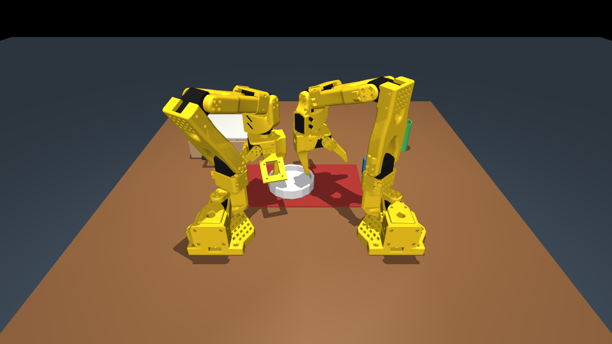
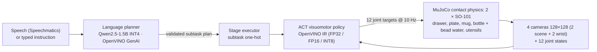

# Table for Two — bimanual SO-101 table setting on OpenVINO



Two simulated SO-101 arms set a dinner table from a spoken or typed instruction:
open the drawer, put the mug and the plate in place, lay the fork, pour water
from the bottle into the mug, and hand the spoon from one arm to the other.
Built for the **Intel Physical AI Online Challenge — Bimanual VLA Manipulation**
at the AI Infra Summit Hackathon (lablab.ai, September 2026).

Everything runs in MuJoCo; every learned model runs through **OpenVINO**.

**No object is ever attached to a gripper.** Every object moves only because
the finger pads squeeze it and friction holds it, the drawer opens because a
finger pushes on its handle, and the water is 24 small beads that really pour.
Mass and friction are randomised per scene, so a grasp that is too weak
genuinely drops the object.

## How it works



1. **Planner** — a 1.5 B instruction model writes a compact plan language, one
   stage per line (`open_drawer left ; pick_place right mug`, `handoff spoon left right`, …).
   The plan is parsed, then checked twice: syntax (known skills, arms, objects)
   and a small simulation of what each hand holds (no pouring without the bottle
   in hand and the mug set down, no placing what is not held, utensils only after
   the drawer opens). Errors go back to the model for one retry; leftover bad
   steps are dropped; a keyword planner is the last resort.
2. **Executor** — runs the plan stage by stage; subtasks in one stage run on both
   arms at the same time. Each stage gives the policy a one-hot subtask token.
3. **Policy** — LeRobot ACT trained on scripted demonstrations, exported to
   OpenVINO and quantised to INT8 with NNCF.
4. **Scripted skills** — generate the demonstrations and act as the fallback in
   hybrid mode (see below).

## Grasping by contact

The scripted skills position the open jaws around an object, close past contact
so the servo keeps squeezing, and move. Getting there took measuring the robot:

| Skill | How the SO-101 does it | Why |
|---|---|---|
| Bottle | side grip on the body, open hand lowered around it from above; pours by tilting about the grip while the lowest point of the lip stays over the mug | a top-down grip covers the mouth, so the water runs onto the wrist (0/24 beads in the mug) |
| Drawer | top-down pinch on the bar pull, fixed finger on the arm side, moving jaw dropped into the gap at a set opening | closing the other way round needs more wrist roll than the arm has; opening wider lands the finger on the drawer front |
| Utensils | top-down pinch on a 10 mm-square handle, jaws stopping 1 mm above the surface | the jaws' collision bodies end 8 mm below the tool point; a flat 5 mm handle leaves the pads 1–2 mm to squeeze |
| Hand-over | both wrist-camera mounts face away from the other hand, spoon held 30° off crosswise, grips 5.6 cm apart | found by a search over angle, grip points and height, measuring the distance between the two arms' collision bodies; straight crosswise they touch |
| Plate | pinch on the wall nearest the arm, moving jaw inside, 3 mm above the floor | a jaw that touches the plate floor jams before it closes |
| Mug | top-down across the body just below the rim, handle beside the jaws | — |

Reach shaped the layout: a top-down hand reaches at most 9 cm above the table
(18–24 cm from the base), a jaws-horizontal hand reaches the table only 30 cm
or more out, so the bottle stands at the far edge of the right arm's workspace.
`tools/grasp_lab.py`, `tools/pour_lab.py` and `tools/trace_stage.py` are the
single-object labs and the per-stage tracer used to find each of these.

## Scene

| Item | Detail |
|---|---|
| Robots | 2 × SO-101 (MuJoCo Menagerie `robotstudio_so101`), 6 position actuators each, grasp-grade contact settings (elliptic cones, `impratio` 10) |
| Task objects | cabinet with a full-extension drawer and bar pull, spoon and fork in the drawer, deep plate, mug, bottle with 24 water beads, placemat |
| Cameras | overhead, operator (behind the arms), front-high, one on each wrist |
| Control | 20 Hz joint targets; policy at 10 Hz |
| Randomisation per seed | object position ±1.2 cm (utensils ±4 mm, ±0.08 rad yaw), mass ×0.8–1.2, friction ×0.7–1.3, light ×0.6–1.2, table colour |
| Success | drawer out > 4.5 cm; plate, fork, spoon and mug within 3 cm of their places, upright and released; ≥ 60 % of the water beads inside the mug |

## Results

**Scripted contact pipeline, 10 held-out seeds (0–9):** 10/10 full task.

| Sub-goal | Success |
|---|---|
| Drawer opened (pulled by its handle) | 10/10 |
| Mug placed | 10/10 |
| Plate on placemat | 10/10 |
| Fork placed | 10/10 |
| Spoon handed over and placed | 10/10 |
| Poured (≥ 60 % of the 24 water beads inside the mug) | 10/10 |

An earlier run failed one seed: randomisation stood the bottle 3 mm inside the
side grip's reach. Gripping the bottle higher when needed made all 30/30
randomised scenes reachable.

**Language planner on Intel hardware** (`bench/benchmark.py`, 5 instructions):

| Device | Plan latency mean / p95 (s) | Time to first token (ms) | Time per token (ms) | Tokens/s |
|---|---|---|---|---|
| CPU (i9-14900HX) | 2.12 / 5.73 | 825 | 28.8 | 34.7 |
| Intel iGPU (Raptor Lake UHD) | 2.22 / 5.15 | 974 | 36.9 | 27.1 |

**Learned policy:** being retrained on contact-physics demonstrations (150
episodes, four cameras). Results and the Intel latency table for the new
network will be filled in here from `policy/rollout.py` and `bench/benchmark.py`.

## Honest notes

- **Water is 24 beads**, not a fluid: each is a 4 mm sphere of 0.27 g. Container
  bases are 8 mm thick; with 5 mm bases the beads tunnelled through the disc.
- **Hardware.** The challenge targets Intel Core Ultra Series 2/3. This build
  was developed and benchmarked on an Intel Core i9-14900HX with its Raptor Lake
  integrated GPU. `bench/benchmark.py` reproduces every number on a Core Ultra
  machine in one command.
- **Hybrid mode** is reported separately from pure-policy results: a stage the
  scripted skill had to finish is counted as assisted, never as a policy success.
- An earlier version of this project (git history) attached objects to the
  gripper with weld constraints; it was replaced because that is not how a real
  gripper holds anything.

## Run it

```bash
python -m venv .venv
.venv\Scripts\pip install mujoco "lerobot[dataset,training]==0.6.1" openvino openvino-genai nncf imageio imageio-ffmpeg scipy
.venv\Scripts\pip install --force-reinstall --no-deps torch==2.11.0 torchvision==0.26.0 --index-url https://download.pytorch.org/whl/cu128   # CUDA build for training
git clone --depth 1 https://github.com/google-deepmind/mujoco_menagerie third_party/mujoco_menagerie
.venv\Scripts\python scene\build_scene.py                     # compose the MJCF scene
.venv\Scripts\python -m sim.task --seeds 0 1 2 3 4 5 6 7 8 9    # scripted 10-seed evaluation
.venv\Scripts\python -m tools.trace_stage --stage 4 --object spoon   # step through one stage with close-ups
.venv\Scripts\python -m planner.download_model                 # Qwen2.5-1.5B INT4 OpenVINO IR
.venv\Scripts\python -m planner.planner "Set the table and pour a drink"
.venv\Scripts\python -m data.record --episodes 150             # LeRobot dataset of scripted demos
.venv\Scripts\python -m policy.train --steps 40000              # ACT on CUDA
.venv\Scripts\python -m policy.export_openvino                 # FP32 / FP16 / INT8 IR + accuracy check
.venv\Scripts\python -m policy.rollout --mode policy           # learned policy, 10 seeds
.venv\Scripts\python -m bench.benchmark                        # Intel inference benchmark
```

## Layout

| Path | What it is |
|---|---|
| `scene/` | MJCF builder (`build_scene.py`) |
| `sim/` | environment, IK, grasp geometry, scripted skills (`skills.py`, `pour.py`), plan executor |
| `planner/` | OpenVINO GenAI planner with plan validation |
| `data/` | LeRobot dataset recorder |
| `policy/` | ACT training wrapper, OpenVINO export, OpenVINO runtime, rollout evaluation |
| `bench/` | Intel inference benchmark |
| `tools/` | grasp and pour labs, per-stage tracer, video and results helpers |
| `docs/` | challenge notes, slides, narration |

## Credits

SO-101 model: [MuJoCo Menagerie `robotstudio_so101`](https://github.com/google-deepmind/mujoco_menagerie) (Apache-2.0), derived from [TheRobotStudio/SO-ARM100](https://github.com/TheRobotStudio/SO-ARM100).
Physics: MuJoCo. Policy: Hugging Face LeRobot (ACT). Inference: Intel OpenVINO, OpenVINO GenAI, NNCF.
Planner model: Qwen2.5-1.5B-Instruct, OpenVINO INT4 conversion from the OpenVINO Hugging Face organisation.
