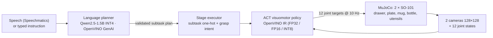

# Table for Two — bimanual SO-101 table setting on OpenVINO


Two simulated SO-101 arms set a dinner table from a spoken or typed instruction:
open the drawer, lay out spoon and fork (with an arm-to-arm hand-off), put the
plate on the placemat, then one arm holds the mug while the other pours from the
bottle. Built for the **Intel Physical AI Online Challenge — Bimanual VLA
Manipulation** at the AI Infra Summit Hackathon (lablab.ai, September 2026).

Everything runs in MuJoCo; every learned model runs through **OpenVINO**.

## How it works



1. **Planner** — a 1.5 B instruction model writes a compact plan language
   (`handoff fork left right`, `pick_hold left mug ; pick_lift right bottle`, …).
   The plan is parsed, then checked twice: syntax (known skills, arms, objects)
   and a small simulation of what each hand holds (no pouring without the
   bottle, no placing what is not held, utensils only after the drawer opens).
   Errors go back to the model for one retry; leftover bad steps are dropped;
   a keyword planner is the last resort.
2. **Executor** — runs the plan stage by stage. Subtasks in one stage run on both
   arms at the same time. Each stage gives the policy a one-hot subtask token.
3. **Policy** — LeRobot ACT trained on scripted demonstrations, exported to
   OpenVINO and quantised to INT8 with NNCF.
4. **Scripted skills** — IK + joint-space interpolation for every subtask. They
   generate the training demonstrations and act as the fallback in hybrid mode.

## Scene

| Item | Detail |
|---|---|
| Robots | 2 × SO-101 (TheRobotStudio model), 6 position actuators each |
| Task objects | drawer cabinet (slide joint), spoon, fork, plate, mug, bottle, placemat |
| Cameras | overhead, operator (behind the arms), front-high |
| Control | 20 Hz joint targets; policy at 10 Hz |
| Randomisation per seed | object position ±1.5 cm (utensils ±4 mm, ±0.15 rad yaw), mass ×0.8–1.2, friction ×0.7–1.3, light ×0.6–1.2, table colour |

## Results

**Scripted pipeline, 10 held-out seeds (0–9):** 10/10 full task.

| Sub-goal | Success |
|---|---|
| Drawer opened | 10/10 |
| Spoon placed | 10/10 |
| Fork handed off and placed | 10/10 |
| Plate on placemat | 10/10 |
| Mug placed | 10/10 |
| Poured (bottle tilted > 60° with its tip over the mug for ≥ 0.5 s) | 10/10 |

**Language planner on Intel hardware** (`bench/benchmark.py`, 5 instructions):

| Device | Plan latency mean / p95 (s) | Time to first token (ms) | Time per token (ms) | Tokens/s |
|---|---|---|---|---|
| CPU (i9-14900HX) | 2.12 / 5.73 | 825 | 28.8 | 34.7 |
| Intel iGPU (Raptor Lake UHD) | 2.22 / 5.15 | 974 | 36.9 | 27.1 |

**ACT policy on Intel hardware** (one forward pass = a 20-step action chunk,
batch 1, two 128×128 views; 200 timed calls after 10 warm-up calls):

| Precision | Device | Latency mean / p95 (ms) | Calls/s | IR size (MB) |
|---|---|---|---|---|
| FP32 | CPU | 15.8 / 18.5 | 63 | 137 |
| INT8 (NNCF) | CPU | **5.9 / 7.7** | **169** | 39 |
| FP32 | Intel iGPU | 10.1 / 11.6 | 99 | 137 |
| FP16 | Intel iGPU | 8.2 / 8.8 | 122 | 68 |

INT8 on CPU is 2.7× faster than FP32. The policy re-plans every 10 control
steps (1 s), so even the slowest variant uses under 2 % of the control budget.
Latency depends only on the network shape, so these numbers carry over to the
final checkpoint; action-accuracy after quantisation is reported per checkpoint
in `models/policy/export_report.json`.

**Learned policy (ACT, 50 demonstrations, 20 k steps, FP32 IR), 10 held-out seeds:**

| Sub-goal | Scripted | Learned policy alone | Hybrid (script finishes timed-out stages) |
|---|---|---|---|
| Drawer opened | 10/10 | 10/10 | 10/10 |
| Spoon placed | 10/10 | 4/10 | 9/10 |
| Fork handed off + placed | 10/10 | 5/10 | 9/10 |
| Plate on placemat | 10/10 | 10/10 | 10/10 |
| Mug placed | 10/10 | 10/10 | 9/10 |
| Poured | 10/10 | 10/10 | 7/10 |
| **Full task** | **10/10** | **4/10** | **6/10** (2.4 assisted stages per episode) |

Per-skill success, each stage started from the scripted state that precedes it:
drawer 10/10, spoon 2/10, fork hand-off 10/10, plate 10/10, mug + bottle pick 10/10,
pour 3/10, put back 10/10, home 10/10.

What the failures look like (diagnosed per seed):

- **Spoon** — grasped in 10/10 seeds, but set down 3.3–4.6 cm from its target
  (the pass line is 3 cm): a consistent near-miss, not a missed grasp.
- **Pour** — in failed seeds the policy reproduces the first half of the pour
  and stops at about 47° of tilt with the spout 7 cm from the mug; successful
  seeds reach 68–71°.
- **Variance** — the same seed can pass in one run and fail in another (e.g.
  seed 9), because tiny numerical differences grow over a minute of contact-rich
  simulation. Treat single-seed results accordingly.
- **Hybrid is not strictly better** — when the policy wanders for the full
  25 s stage timeout before the script takes over, it can disturb objects that
  later stages need, which is why pouring drops to 7/10 in hybrid mode.

A second policy trained on three times the demonstrations for twice the steps is
in progress; these numbers will be updated if it does better.

## Honest notes

- **Grasping is constraint-assisted.** When a gripper closes near an object, a
  weld (or, for the drawer handle, a position-only connect) attaches it at the
  current relative pose; opening the gripper releases it. This is a common
  simulation shortcut; contact-rich finger grasping is out of scope.
- **Hardware.** The challenge targets Intel Core Ultra Series 2/3. This build
  was developed and benchmarked on an Intel Core i9-14900HX with its Raptor Lake
  integrated GPU. `bench/benchmark.py` reproduces every number on a Core Ultra
  machine in one command.
- **Hybrid mode** is reported separately from pure-policy results: a stage the
  scripted skill had to finish is counted as assisted, never as a policy success.

## Run it

```bash
python -m venv .venv
.venv\Scripts\pip install mujoco "lerobot[dataset,training]==0.6.1" openvino openvino-genai nncf imageio imageio-ffmpeg scipy
.venv\Scripts\pip install --force-reinstall --no-deps torch==2.11.0 torchvision==0.26.0 --index-url https://download.pytorch.org/whl/cu128   # CUDA build for training
git clone --depth 1 https://github.com/TheRobotStudio/SO-ARM100 third_party/SO-ARM100
.venv\Scripts\python scene\build_scene.py                     # compose the MJCF scene
.venv\Scripts\python -m sim.task --seeds 0 1 2 3 4 5 6 7 8 9    # scripted 10-seed evaluation
.venv\Scripts\python -m planner.download_model                 # Qwen2.5-1.5B INT4 OpenVINO IR
.venv\Scripts\python -m planner.planner "Set the table and pour a drink"
.venv\Scripts\python -m data.record --episodes 50              # LeRobot dataset of scripted demos
.venv\Scripts\python -m policy.train                           # ACT on CUDA
.venv\Scripts\python -m policy.export_openvino                 # FP32 / FP16 / INT8 IR + accuracy check
.venv\Scripts\python -m policy.rollout --mode policy           # learned policy, 10 seeds
.venv\Scripts\python -m bench.benchmark                        # Intel inference benchmark
```

## Layout

| Path | What it is |
|---|---|
| `scene/` | MJCF builder (`build_scene.py`), reachability and render checks |
| `sim/` | environment, IK, scripted skills, plan executor |
| `planner/` | OpenVINO GenAI planner with plan validation |
| `data/` | LeRobot dataset recorder |
| `policy/` | ACT training wrapper, OpenVINO export, OpenVINO runtime, rollout evaluation |
| `bench/` | Intel inference benchmark |
| `docs/` | challenge brief notes |

## Credits

SO-101 model: [TheRobotStudio/SO-ARM100](https://github.com/TheRobotStudio/SO-ARM100) (see its licence).
Physics: MuJoCo. Policy: Hugging Face LeRobot (ACT). Inference: Intel OpenVINO, OpenVINO GenAI, NNCF.
Planner model: Qwen2.5-1.5B-Instruct, OpenVINO INT4 conversion from the OpenVINO Hugging Face organisation.
