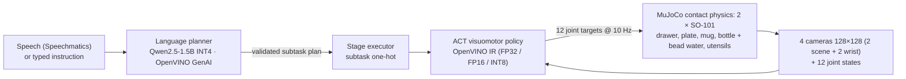

# Table for Two — bimanual SO-101 table setting on OpenVINO


Two simulated SO-101 arms set a dinner table from a spoken or typed instruction:
carry the plate to the placemat with both hands, open the drawer while placing
the mug, lay the fork, pour water from the bottle into the mug, put the bottle
back, and hand the spoon from one arm to the other. Built for the **Intel
Physical AI Online Challenge — Bimanual VLA Manipulation** at the AI Infra
Summit Hackathon (lablab.ai, September 2026).

Everything runs in MuJoCo; every learned model runs through **OpenVINO**.

**No object is ever attached to a gripper.** Every object moves only because
the finger pads squeeze it and simulated friction holds it, the drawer opens
because a finger pulls on its handle, and the water is 24 small beads that
pour like lentils. The gripper is modelled on the stock 7.4 V servo at the
torque it can sustain (0.8 N·m, about 10 N at the fingertip, not the 2.94 N·m
stall figure), with rubber pads of μ = 0.8. Object mass, pad friction and
object friction are randomised per scene.

## How it works



1. **Planner** — a 1.5 B instruction model writes a compact plan language, one
   stage per line (`bimanual_place plate`, `open_drawer left ; pick_place right mug`,
   `handoff spoon left right`, …).
   The plan is parsed, then checked twice: syntax (known skills, arms, objects)
   and a small simulation of what each hand holds (no pouring without the bottle
   in hand and the mug set down, no placing what is not held, utensils only after
   the drawer opens). Errors go back to the model for one retry; leftover bad
   steps are dropped; a keyword planner is the last resort.
2. **Executor** — runs the plan stage by stage; subtasks in one stage run on both
   arms at the same time. Each stage gives the policy a one-hot subtask token —
   this token is how language reaches the policy (a planner-conditioned ACT, not
   an end-to-end VLA).
3. **Policy** — LeRobot ACT trained on scripted demonstrations, exported to
   OpenVINO and quantised to INT8 with NNCF. It sees four 128×128 cameras and
   the joint positions, nothing else.
4. **Scripted skills** — generate the demonstrations and act as the fallback in
   hybrid mode (see below). They use ground-truth object poses and contact
   events from the simulator; the policy has to learn the same behaviour from
   pixels.

## Grasping by contact

The scripted skills position the open jaws around an object, close past contact
so the servo keeps squeezing, and move. Getting there took measuring the robot:

| Skill | How the SO-101 does it | Why |
|---|---|---|
| Bottle | side grip on the body, open hand lowered around it from above; pours by tilting about the grip while the lowest point of the lip stays over the mug | a top-down grip covers the mouth, so the water runs onto the wrist (0/24 beads in the mug) |
| Drawer | top-down pinch on the bar pull, fixed finger on the arm side, moving jaw dropped into the gap at a set opening | closing the other way round needs more wrist roll than the arm has; opening wider lands the finger on the drawer front |
| Utensils | top-down pinch on a 10 mm-square handle, jaws stopping 1 mm above the surface | the jaws' collision bodies end 8 mm below the tool point; a flat 5 mm handle leaves the pads 1–2 mm to squeeze |
| Hand-over | both wrist-camera mounts face away from the other hand, spoon held 30° off crosswise, grips 5.6 cm apart | found by a search over angle, grip points and height, measuring the distance between the two arms' collision bodies; straight crosswise they touch |
| Plate | carried by **both arms**, each pinching an opposite 5 mm wall (thin fixed finger inside, moving jaw outside), moving in lockstep | one hand on one wall leaves the plate hanging 6–8° (its centre of mass is 4.5 cm from the pinch); with two hands it stays within 2.5°. On a 3 mm wall the jaws closed to their joint limit and the plate slid 1–2 cm through the pads at set-down once the servo torque was made realistic |
| Mug | top-down across the body just below the rim, handle beside the jaws, tipped level while carried | — |
| Utensils (one arm) | gripped over their centre of mass | gripped at the handle end the fork sagged 12–17° and slid |
| Every set-down | lowered in 1.5 mm steps until the object touches a support, then the fingers open and slide off the object before lifting | releasing at a computed height dropped the fork 2.8 cm at 0.7 m/s; lifting straight after opening let two hands inside the plate lift it and fling it |

Reach shaped the layout: a top-down hand reaches at most 9 cm above the table
(18–24 cm from the base), a jaws-horizontal hand reaches the table only 30 cm
or more out, so the bottle stands at the far edge of the right arm's workspace.
`tools/grasp_lab.py`, `tools/pour_lab.py` and `tools/trace_stage.py` are the
single-object labs and the per-stage tracer used to find each of these.

## Scene

| Item | Detail |
|---|---|
| Robots | 2 × SO-101 (MuJoCo Menagerie `robotstudio_so101`), 6 position actuators each, Menagerie's grasp contact settings (elliptic cones, `impratio` 10) |
| Gripper | torque capped at 0.8 N·m (stock 7.4 V STS3215: 1.62 N·m stall, overload protection trips within seconds at stall); finger pads μ = 0.8; measured pad force while holding 20–27 N |
| Task objects (child-tableware scale, sized for a 5 cm jaw) | cabinet with a full-extension drawer and bar pull; spoon and fork with chunky 10 mm handles (9.6 cm long, ~23 g); a 9 cm ramekin-sized deep dish (120 g); a 4.8 cm espresso mug (130 g); a 3.2 × 7 cm glass vial (40 g) with 24 water beads (6.5 ml); placemat |
| Cameras | overhead, operator (behind the arms), front-high, one on each wrist |
| Control | 20 Hz joint targets; policy at 10 Hz |
| Randomisation per seed | object position ±1.2 cm (utensils ±4 mm, ±0.08 rad yaw), object mass ×0.8–1.2, pad friction ×0.7–1.3 (this is what changes grasps: the pads' friction governs every finger–object contact), object friction ×0.7–1.3 (sliding on the table), light ×0.6–1.2, table colour |
| Success (scored 1 s after the last motion) | drawer open > 4.5 cm *now*; plate, fork, spoon and mug within 3 cm of their places, resting on the table only (not on each other), upright (< 12°) and released; ≥ 60 % of the beads at rest inside the mug with ≤ 2 spilled; bottle lifted, then standing upright within 3 cm of where it started |

## Results

**Scripted contact pipeline.** Seeds 0–9 are the evaluation seeds the brief
asks for (seed 0 is the nominal layout, 1–9 randomised) and also the seeds the
skills were debugged on, so they are reported next to a block of 30 seeds
(1000–1029) that were never looked at:

| Sub-goal | Seeds 0–9 | Unseen seeds 1000–1029 |
|---|---|---|
| Drawer opened (pulled by its handle) | SCRIPTED_0_9_DRAWER | FRESH_DRAWER |
| Mug placed | SCRIPTED_0_9_MUG | FRESH_MUG |
| Plate on placemat (two-handed) | SCRIPTED_0_9_PLATE | FRESH_PLATE |
| Fork placed | SCRIPTED_0_9_FORK | FRESH_FORK |
| Spoon handed over and placed | SCRIPTED_0_9_SPOON | FRESH_SPOON |
| Poured (≥ 60 % of the beads in the mug, ≤ 2 spilled) | SCRIPTED_0_9_POURED | FRESH_POURED |
| Bottle put back | SCRIPTED_0_9_BOTTLE | FRESH_BOTTLE |
| **Full task** | **SCRIPTED_0_9_ALL** | **FRESH_ALL** |

`tools/audit_contact.py` checks every hold on the same seeds: no object is
released in mid-air, none is lost while the fingers squeeze, and touch-down
speeds stay under 0.05 m/s.

**Language planner on Intel hardware** (`bench/benchmark.py`, 5 instructions,
measured with an earlier prompt that lacked the two-handed plate rule; to be
re-measured):

| Device | Plan latency mean / p95 (s) | Time to first token (ms) | Time per token (ms) | Tokens/s |
|---|---|---|---|---|
| CPU (i9-14900HX) | 2.12 / 5.73 | 825 | 28.8 | 34.7 |
| Intel iGPU (Raptor Lake UHD) | 2.22 / 5.15 | 974 | 36.9 | 27.1 |

**Learned policy:** being retrained on contact-physics demonstrations (150
episodes, four cameras). Results, INT8 accuracy and the Intel latency table for
the four-camera network will be filled in here from `policy/rollout.py`,
`policy/export_openvino.py` and `bench/benchmark.py`. Latency will be reported
two ways: isolated single-call (zero inputs, 200 calls) and in-the-loop
(render + preprocess + infer + postprocess, as measured during rollouts).

## Honest notes

- **The mug stands on the table while it is poured into; the other hand does not
  steady it.** The brief's scene has one hand hold the cup while the other pours.
  With two SO-101s a full pour is only reachable by rolling the bottle sideways
  toward the other arm, which puts the steadying hand beside the mug's rim. We
  searched 12 mug positions × pour directions × steadying grips (body side-grip,
  handle pinch; 6 cm and 9 cm mugs), measuring the distance between the arms'
  collision bodies over every pour pose: the best layout left 3 mm, most
  overlapped, and with a 9 cm mug no position allowed a full pour at all. So the
  bimanual coordination is shown instead by the two-handed plate carry and the
  spoon hand-over.
- **The hand-over holds the spoon off its balance point** (each hand 2.8 cm from
  the handle centre, the only collision-free layout found), so the spoon sags
  10–13° in the hands; it is still set down by touch.
- **Water is 24 beads**, not a fluid: each is a sphere of 4 mm radius and
  0.27 g (6.5 ml in all), a granular proxy that pours like lentils. Container
  bases are 8 mm thick; with 5 mm bases the beads tunnelled through the disc.
- **The gripper model is our choice, not Menagerie's.** The Menagerie file
  models the optional 12 V servo at stall (2.94 N·m, ~37 N at the tip, 75–160 N
  of pad force in our earlier runs — 340× a spoon's weight) with hard fingers
  at μ = 1. We cap the torque at 0.8 N·m and use μ = 0.8 rubber pads. Pad force
  while holding is now 20–27 N. Real pad friction on a wet ceramic mug may be
  lower.
- **The props are child-tableware scale** (the jaws open 5 cm): chunky 10 mm
  handles, a ramekin-sized dish, a vial for a bottle. A flat 2 mm steel fork is
  out of this gripper's reach.
- **The demonstrations are privileged.** Scripted skills read exact object
  poses, centres of mass and contact events (set-downs stop at the first
  contact). The policy sees only cameras and joints, with no gripper load
  signal, so it must learn timing from pixels.
- **Stage completion is judged by the simulator.** During rollouts an oracle
  reads the physical state to decide when a stage is done and advances the
  policy's subtask token; the policy does not detect completion itself. `home`
  stages are never scored, and a stage's success is also reported conditional
  on every earlier stage having been solved by the policy.
- **Hardware.** The challenge targets Intel Core Ultra Series 2/3. This build
  was developed and benchmarked on an Intel Core i9-14900HX with its Raptor Lake
  integrated GPU; the NVIDIA RTX 4060 in the same laptop was used only to train
  ACT — every inference number is Intel CPU or iGPU. `bench/benchmark.py`
  reproduces every number on a Core Ultra machine in one command.
- **Hybrid mode** is reported separately from pure-policy results: a stage the
  scripted skill had to finish is counted as assisted, never as a policy success.
- **Runs are deterministic given the seed** (IK restarts are seeded per
  episode); policy results on OpenVINO iGPU/INT8 may not be bit-stable, and are
  single runs unless stated.
- An earlier version of this project (git history) attached objects to the
  gripper with weld constraints; it was replaced because that is not how a real
  gripper holds anything.

## Run it

Requirements: Python 3.12 (Ubuntu 24.04's default), git, ~10 GB of disk.
On Ubuntu: `sudo apt install python3.12-venv libegl1 libgl1 fonts-dejavu-core git`.
A headless Linux machine (no display) also needs `export MUJOCO_GL=egl` before
anything that renders (recording, rollouts, videos); the scripted evaluation
renders nothing and runs anywhere.

### 1. Install (10–20 min, mostly PyTorch)

```bash
bash scripts/install.sh                                         # Linux; add --cuda for GPU training
powershell -ExecutionPolicy Bypass -File scripts\install.ps1    # Windows; add -Cuda for GPU training
```

This creates `.venv`, installs the pinned `requirements.txt`, clones only
`robotstudio_so101` from MuJoCo Menagerie into `third_party/`, generates
`scene/bimanual_table.xml` and runs the 21 unit tests. Below, `python` means
`.venv/bin/python` (Linux) or `.venv\Scripts\python` (Windows; set
`$env:PYTHONUTF8 = "1"` first).

### 2. Scripted contact pipeline — no downloads, CPU only

```bash
python -m sim.task                                   # seeds 0-9, ~30 s wall each; add --video out/scripted.mp4
python -m sim.task --seeds $(seq 1000 1029)          # the unseen block (PowerShell: --seeds (1000..1029))
python -m tools.audit_contact --seeds 0 1 2          # balance / set-down / drop audit, ~30 s per seed
python -m tools.trace_stage --stage 5 --object spoon # one stage (0-based; 5 = hand-over) with close-ups
```

### 3. Language planner — one 0.9 GB download

```bash
python -m planner.download_model                     # Qwen2.5-1.5B-Instruct INT4 IR from Hugging Face (not gated)
python -m planner.planner "Set the table and pour a drink"    # ~2 s per plan on CPU after loading
python demo.py --seed 3                              # instruction -> plan -> scripted execution -> out/demo.mp4
python -m bench.benchmark --skip-planner             # policy IRs only; drop the flag to time the planner too
```

Spoken input: copy `.env.example` to `.env`, add a Speechmatics key, then
`python demo.py --audio your.wav`.

### 4. Learned policy — optional; needs an NVIDIA GPU (or the released checkpoint)

Download the trained checkpoint and OpenVINO IRs from the GitHub release
(link to be added) and unpack them to `outputs/act_contact/` and
`models/policy/`, or retrain:

```bash
python -m data.record --episodes 150                 # ~2.5 h; 4 cameras at 10 Hz -> data/dinner_table_contact/
python -m policy.train --steps 40000                 # ~3.5 h on an RTX 4060 (install with --cuda); --device cpu works but takes days
python -m policy.export_openvino                     # FP32 / FP16 / INT8 IR + accuracy report, a few minutes
python -m policy.rollout --mode policy               # learned policy alone, seeds 0-9, 40 s per stage
python -m policy.rollout --mode hybrid               # a scripted skill finishes any timed-out stage (counted as assisted)
python -m policy.rollout --stagewise                 # each stage from a scripted start state
python -m bench.benchmark                            # planner + every IR in models/policy on CPU / iGPU / NPU
```

### 5. Media — optional, not needed for any result

```bash
python demo.py --executor policy --seed 8 --out out/demo_policy_seed8.mp4
python -m sim.task --video out/grid_10seeds.mp4
python -m piper.download_voices en_US-lessac-medium --download-dir models/tts
python -m tools.voiceover && python -m tools.make_video --voice-dir out/voice
cd docs/slides && npm ci && node build_deck.js       # Node 18+; the built table_for_two.pptx is tracked
```

## Layout

| Path | What it is |
|---|---|
| `scene/` | MJCF builder (`build_scene.py`) |
| `sim/` | environment, IK, grasp geometry, scripted skills (`skills.py`, `pour.py`), plan executor |
| `planner/` | OpenVINO GenAI planner with plan validation |
| `data/` | LeRobot dataset recorder |
| `policy/` | ACT training wrapper, OpenVINO export, OpenVINO runtime, rollout evaluation |
| `bench/` | Intel inference benchmark |
| `tools/` | grasp and pour labs, per-stage tracer, contact audit, video and results helpers |
| `docs/` | slides (`docs/slides`, pptxgenjs), narration, media |
| `scripts/` | one-command installers |

Generated and ignored: `scene/bimanual_table.xml`, `third_party/`, `models/`,
`data/*/`, `outputs/`, `out/`. Versions are pinned in `requirements.txt`
(MuJoCo 3.13, LeRobot 0.6.1, OpenVINO 2026.3, NNCF 3.3, PyTorch 2.11).

## Credits and licences

This repository is MIT. It uses, unmodified and not vendored:

- SO-101 model: [MuJoCo Menagerie `robotstudio_so101`](https://github.com/google-deepmind/mujoco_menagerie) (Apache-2.0), derived from [TheRobotStudio/SO-ARM100](https://github.com/TheRobotStudio/SO-ARM100).
- Physics: MuJoCo (Apache-2.0). Policy: Hugging Face LeRobot, ACT (Apache-2.0). Inference: Intel OpenVINO, OpenVINO GenAI, NNCF (Apache-2.0).
- Planner model: Qwen2.5-1.5B-Instruct (Apache-2.0), INT4 OpenVINO conversion from the OpenVINO Hugging Face organisation.
- Voice-over: Piper TTS (MIT) with the `en_US-lessac-medium` voice (see its model card for the voice licence). Speech input: Speechmatics (commercial API, key required, optional).
